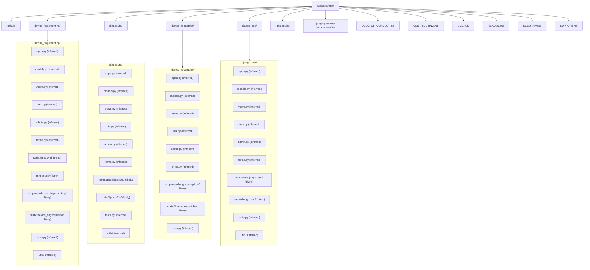

# Get started
Welcome to Django Crafts! This repository contains various Django projects and tutorials to help you learn and implement different Django features and functionalities.

## Project Structure
The repository is organized into several sections, each focusing on a specific aspect of Django development. Each section contains a dedicated folder with relevant code examples and documentation.

## Cloning a Specific Folder

If you want to clone only a specific project folder instead of the entire repository, you can use sparse checkout with git. Follow these steps:

1. Create a new directory and initialize a git repository:
   ```bash
   mkdir my-project
   cd my-project
   git init
   ```

2. Add the remote repository:
   ```bash
   git remote add origin https://github.com/YOUR_USERNAME/Django-Crafts.git
   ```

3. Enable sparse checkout:
   ```bash
   git config core.sparseCheckout true
   ```

4. Specify the folder you want to clone (e.g., django2fa):
   ```bash
   echo "django2fa/" >> .git/info/sparse-checkout
   ```

5. Pull the content:
   ```bash
   git pull origin main
   ```

Now you have only the django2fa folder in your local repository.

## Contributing
Now you have only the django2fa folder in your local repository, which makes it easier to focus on a specific project.

1. **Create a Branch**: Create a new branch for your feature or bug fix.
   ```bash
   git checkout -b feature/your-feature-name
   ```

2. **Make Changes**: Implement your changes, following our coding standards.

3. **Test Your Changes**: Ensure your changes work as expected and don't break existing functionality.

4. **Commit Your Changes**: Commit your changes with a clear and descriptive commit message.
   ```bash
   git commit -m "Add a descriptive message about your changes"
   ```

5. **Push to Your Fork**: Push your changes to your forked repository.
   ```bash
   git push origin feature/your-feature-name
   ```

6. **Submit a Pull Request**: Create a pull request from your branch to our main repository.

## Repo Structure


